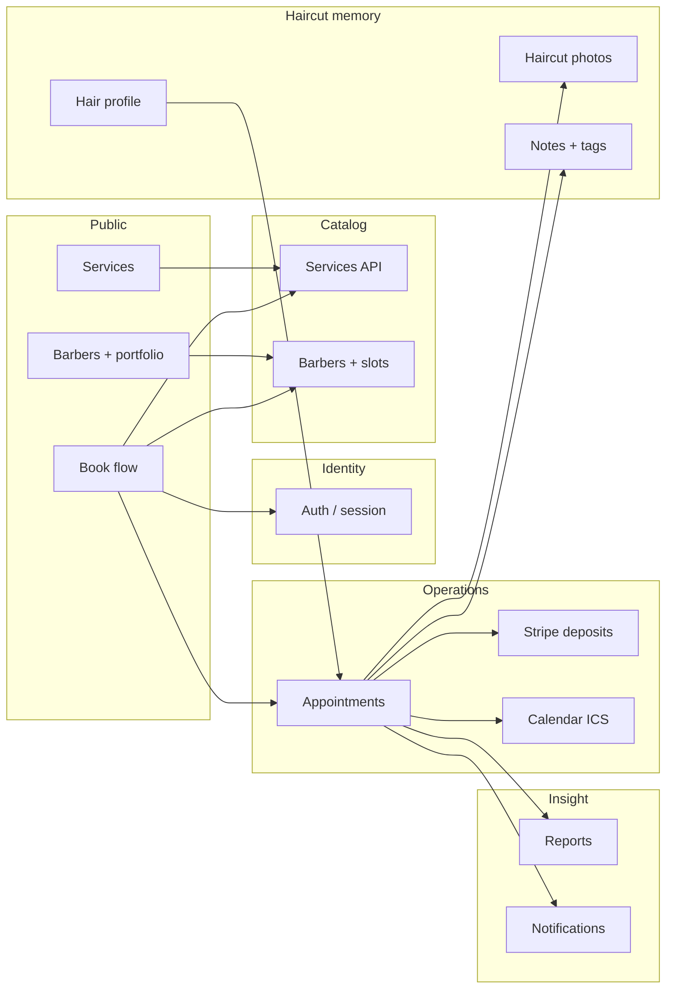

# Ozilcuts — functional system document

**Audience:** External GPTs, internal tools, and humans who need **accurate codebase context** without loading the whole monorepo.  
**Scope:** What the product does today, how pieces connect, known limits, where to look in code, and how to combine this file with `docs/roadmap/` for planning.  
**Companion docs:** [`docs/ARCHITECTURE.md`](docs/ARCHITECTURE.md), [`docs/CODING_STANDARDS.md`](docs/CODING_STANDARDS.md), [`docs/deployment/vercel-frontend-plesk-backend.md`](docs/deployment/vercel-frontend-plesk-backend.md), [`docs/QA_CHECKLIST.md`](docs/QA_CHECKLIST.md), [`docs/CURSOR_RULES.md`](docs/CURSOR_RULES.md).

---

## 0. Quick orientation for LLMs

**What this file is:** A **stable narrative + index**. It is not a line-by-line spec; always open **primary sources** (routes, types, controllers) when implementing.

**What to attach in an external GPT chat (recommended bundle):**

1. This file: **`create.md`** (repo root).
2. For API behaviour: **`apps/backend/routes/api/v1.php`** (or the specific controller under `apps/backend/app/Http/Controllers/Api/V1/`).
3. For request/response shapes: **`packages/types/src/index.ts`** (large; prefer grep or a narrowed excerpt).
4. For web calls: **`packages/api/src/<domain>.ts`** matching the feature (e.g. `booking.ts`, `manageServices.ts`).
5. For UI: **`apps/web/src/app/.../page.tsx`** or **`apps/web/src/components/...`** as relevant.
6. For planned work: one or more **`docs/roadmap/sprint-*.md`** files.

**Suggested discovery order (minimizes wrong assumptions):**

1. Confirm route exists and method → `apps/backend/routes/api/v1.php`.
2. Open the single-action controller → trace to FormRequest / Policy / Service.
3. Mirror types in `packages/types` and client in `packages/api`.
4. Find Next page or component under `apps/web/src/app` or `apps/web/src/components`.

**Non-goals:** Do not infer multi-tenant org models, payment edge cases, or authorization solely from the Next layer; **Laravel policies and controller checks are authoritative**.

---

## 1. Repository map (monorepo)

| Path | Role |
|------|------|
| `apps/web/` | Next.js 15 App Router UI; `@/` → `apps/web/src/` |
| `apps/backend/` | Laravel 12 API; routes in `routes/api/v1.php` |
| `packages/types/` | Shared TypeScript types (`@ozilcuts/types`) |
| `packages/api/` | Typed fetch helpers (`@ozilcuts/api`), `getApiBaseUrl()` in `packages/api/src/base.ts` |
| `packages/ui/` | Shared UI primitives (`@ozilcuts/ui`), Tailwind + components |
| `docs/roadmap/` | Sprint intent docs (filename themes, not delivery status) |

**Web path alias:** `apps/web/tsconfig.json` maps `@/*` → `./src/*`.

---

## 2. Product snapshot

**Ozilcuts** is a **shop-scoped** barbershop operations product: customers book services with specific barbers; barbers run their day on a calendar; admins configure the catalog, chairs, hours, and reporting. The live client is primarily a **Next.js web app** (PWA-oriented); roadmap work includes **React Native** and deeper mobile/POS flows that are not necessarily shipped in the web app yet.

**Currency:** Amounts are stored as **integer minor units (pence)** in fields historically named `*_cents`. The UI formats **GBP** (`en-GB`). Shared helpers live under `apps/web/src/lib/format-gbp.ts`. Stripe defaults align to **`gbp`** in backend config (override with `STRIPE_CURRENCY` in `.env`).

---

## 3. Technical architecture (condensed)

| Layer | Technology |
|--------|------------|
| Frontend | Next.js 15, TypeScript, Tailwind, shared `@ozilcuts/ui`, Framer Motion |
| Backend | Laravel 12 API, Sanctum, PostgreSQL, Redis, Horizon/queues |
| Contracts | `@ozilcuts/types` (shared types), `@ozilcuts/api` (typed fetch clients) |

**Principles:** API-first; backend owns business logic; mobile-first UX.

**Auth:** Bearer token (Sanctum). Public reads for catalog (services, barbers, slots). Writes almost always require `auth:sanctum`. The web stores the token client-side and sends it on API calls (see `apps/web/src/lib/auth-token.ts` and API client usage).

**Important paths:**

- Web app: `apps/web/src/app/**` (App Router pages).
- HTTP API: `apps/backend/routes/api/v1.php` (single source of route list).
- Shared clients: `packages/api/src/*.ts`.
- Shared types: `packages/types/src/index.ts`.

---

## 4. Conventions that confuse GPTs (read once)

| Topic | Convention |
|--------|---------------|
| Money fields | JSON/DB: `price_cents`, `deposit_cents`, etc. **Semantics:** pence (minor GBP units). |
| API base URL | `getApiBaseUrl()` — browser uses `NEXT_PUBLIC_API_URL` (see `apps/web/.env.example`); SSR/build may differ (`next.config.ts` also references `BACKEND_URL`). |
| API prefix | All JSON API routes under **`/api/v1/`**. |
| Versioning | Prefer changing behaviour in Laravel + types together; keep `packages/api` callers aligned. |
| UI role checks | `useSessionProfile()` exposes `role.slug`; **never** treat as security boundary. |
| Report / filter UI | Reuse `apps/web/src/lib/report-filter-classes.ts` for date grids on small screens. |

---

## 5. “Where do I look?” index

| If you need… | Start here |
|----------------|-------------|
| Every HTTP route | `apps/backend/routes/api/v1.php` |
| Who can call a route | Controller + Laravel Policy (see `apps/backend/app/Policies/` if present) |
| Business logic | `apps/backend/app/Services/` (service-layer pattern per `docs/CODING_STANDARDS.md`) |
| DTO / validation | Form requests under `apps/backend/app/Http/Requests/` (when used) |
| TS types for API | `packages/types/src/index.ts` |
| Browser fetch wrapper | `packages/api/src/<feature>.ts` + `packages/api/src/index.ts` exports |
| Next page for a URL | `apps/web/src/app/**/page.tsx` |
| Global nav / account menu | `apps/web/src/lib/site-primary-nav.ts` |
| Stripe / payment config | `apps/backend/config/services.php`, `PaymentService`, `AppointmentPaymentIntentController` |
| Emails (deposit line, etc.) | `apps/backend/resources/views/emails/` |

---

## 6. Roles

| Role slug | Typical user | Primary surfaces |
|-----------|----------------|------------------|
| `customer` | Booked guest | `/book`, `/appointments`, `/profile`, `/dashboard`, `/services`, `/barbers` |
| `barber` | Staff on the floor | `/barber`, `/barber/calendar`, `/barber/hours`, `/barber/analytics`, `/barber/profile` |
| `admin` | Owner/manager | `/admin`, `/admin/services`, `/admin/barbers`, `/admin/reports/*`, `/admin/onboarding`, `/admin/customers/...` |

**Authorization:** Enforced in Laravel controllers/policies (not documented exhaustively here). The Next app mirrors role UX via `useSessionProfile()` and `profile.user.role.slug`. Admins may receive extra fields (e.g. `shop_admin`, onboarding flags) on `CurrentUser`.

---

## 7. Core domain (conceptual)

- **Shop** — implicit tenant; admin onboarding and templates (e.g. default availability) are shop-level.
- **User** — auth identity; can be customer, barber, or admin.
- **Barber** — public profile + portfolio; **availability windows**; bookable **slots** derived from availability and service duration.
- **Service** — name, duration, **price/deposit in pence**, deposit policy (`always` \| `first_time_customer`), active flag, sort order.
- **Appointment** — customer + barber + service + start time; lifecycle includes confirm/cancel/reschedule; **payment status** for deposits; optional **walk-in** creation path.
- **Hair profile** — customer-owned reference (text + photos) for preferences; can be surfaced on an appointment for staff.
- **Haircut photos** — per-appointment gallery (“haircut memory”).
- **Customer notes & tags** — staff CRM layer on a customer user.
- **Notifications** — in-app feed + preferences.
- **Reports** — revenue, barber comparison, customer aggregates, operational insights, retention preview.

---

## 8. Feature catalogue (as implemented in web + API)

### 8.1 Public / pre-auth

- Home, services list, barber directory, barber detail + **portfolio** gallery.
- **Book** flow: pick service → barber (optional constraints) → date → slot → submit (auth required for final booking).
- Auth: **email register/login**, **Google OAuth** (redirect + callback).
- Health: `GET /api/v1/health`.
- Signed, throttled URLs: calendar `.ics`, hair profile photos, haircut photos.

### 8.2 Customer

- **Appointments:** list with filters (upcoming/past/all, status), cancel, reschedule, link to confirmation.
- **Confirmation:** details, deposit pay (Stripe Elements), calendar link, rebook hints, haircut memory entrypoints, staff POS helper card when applicable.
- **Profile:** account fields, preferred barber.
- **Hair:** hair profile CRUD + photo upload/delete (signed fetch).
- **Visits:** history/summary from API.
- **Dashboard / settings:** lightweight hub + notification prefs entry.
- **Notifications:** list + unread count + mark read (poll-driven UX in app).
- **Rebooking nudges:** next-visit suggestion on home/booking; snooze API for nudges.

### 8.3 Barber

- **Dashboard:** hub links into calendar, hours, analytics, profile.
- **Calendar:** day/workflow view (week-style availability UI varies by page).
- **Hours:** manage own availability (backed by manage availability API when acting as self; admin can manage others).
- **Analytics:** personal KPIs and tables (booked vs collected, etc.).
- **Profile:** self-service barber-facing profile.

### 8.4 Admin

- **Onboarding:** shop setup wizard; `shop_admin.onboarding_completed_at` gates “incomplete setup” messaging on admin home.
- **Services CRUD:** create/edit/delete, starter pack, **GBP** pound inputs for price/deposit.
- **Barbers:** list/create; per-barber **hours/availability** editor; **analytics** deep link.
- **Staff customer search** — lookup customers for assisted booking (`/staff/customers/search`).
- **Reports:**  
  - Revenue (+ CSV download)  
  - Barber compare  
  - Customer aggregate + **per-customer analytics**  
  - Operational insights (load, cancel rates, etc.)  
  - Retention (preview/audience-oriented; see code for exact semantics)  
- **Profile** — admin’s own user profile surface.

### 8.5 Cross-role / staff workflows

- **Book on behalf:** booking API accepts optional `customer_user_id` for admin/barber flows; staff lookup supports discovery.
- **Walk-in:** `POST /appointments/walk-in` (throttled) for front-desk style creation.
- **Reminders / running late:** outbound actions from appointment rows (throttled POSTs).
- **Appointment-level hair profile read** for chair-side context.
- **Haircut photos** on appointment: upload, edit metadata, delete.

---

## 9. How features interlink

**Dependency rules (simplified):**

- **Slots** depend on **barber availability** + **service duration**.
- **Deposits** depend on **service deposit policy** + **Stripe** config + appointment **payment status** machine.
- **Reports** depend on **appointments** and **payments** aggregates (read models / SQL in Laravel services).
- **Haircut memory** depends on **appointment** existing and permissions to view/upload.
- **Rebook suggestions** depend on **visit history** and suggestion endpoints.

---

## 10. User stories & flows (planning-oriented)

### Customer

1. **As a customer**, I browse services and barbers, then **book a slot** so the shop holds my place.  
   *Touch:* `/services`, `/barbers`, `/book`, `POST /appointments`, confirmation email fragments.
2. **As a customer**, I **pay a deposit** when required so my booking is secured.  
   *Touch:* `GET .../payment-intent`, Stripe Elements, webhooks, `STRIPE_CURRENCY`.
3. **As a customer**, I **reschedule or cancel** within shop rules.  
   *Touch:* `/appointments/[id]/reschedule`, cancel PATCH.
4. **As a customer**, I maintain a **hair profile** so barbers see preferences.  
   *Touch:* `/profile/hair`, hair profile API, signed photos.
5. **As a customer**, I see **visit history** and **notifications** so I stay oriented.  
   *Touch:* `/profile/visits`, `/notifications`.

### Barber

6. **As a barber**, I see **who is on my calendar** today and upcoming.  
   *Touch:* `/barber/calendar`, appointment APIs.
7. **As a barber**, I set **when I am bookable** so slots stay accurate.  
   *Touch:* `/barber/hours`, availability PUT.
8. **As a barber**, I review **my performance** over a period.  
   *Touch:* `/barber/analytics`, barber analytics API.

### Admin

9. **As an admin**, I **define services and pricing** so booking reflects the menu.  
   *Touch:* `/admin/services`, manage services API.
10. **As an admin**, I **onboard barbers and hours** so customers can book.  
    *Touch:* `/admin/barbers`, `/admin/barbers/[id]/hours`, manage barbers + availability.
11. **As an admin**, I use **reports** to compare revenue, barbers, customers, ops, retention.  
    *Touch:* `/admin/reports/*`, CSV export on revenue.

### Staff-assisted

12. **As staff**, I **find a customer** and book or walk them in without self-serve friction.  
    *Touch:* staff customer search, optional `customer_user_id` on create, walk-in POST.

---

## 11. API surface (grouped)

All under **`/api/v1/`** unless noted. Throttling middleware varies per route (see `routes/api/v1.php`).

| Group | Examples |
|-------|-----------|
| Public catalog | `GET /services`, `GET /barbers`, `GET /barbers/{user}`, `GET .../availability`, `GET .../slots`, `GET .../portfolio` |
| Auth | `POST /auth/register`, `POST /auth/login`, `POST /auth/logout`, Google redirect/callback |
| User session | `GET /user` |
| Customer profile | `GET|PATCH /customer/profile`, hair profile + photos |
| Manage (admin) | barbers CRUD-ish, `PUT .../availability`, services CRUD, starter pack, shop onboarding patch |
| Appointments | index, show, create, walk-in, cancel, reschedule, reminder, running late, calendar URL, payment intent, rebook hint, rebook nudge snooze |
| Staff CRM | notes/tags CRUD, tag suggestions, appointment hair profile |
| Haircut memory | appointment haircut photo list/upload; patch/delete photo |
| Payments | `GET /payments/config`, `POST /stripe/webhook` |
| Notifications | list, unread count, mark read, preferences |
| Reports (admin) | revenue (+ `.csv`), barbers compare, customers aggregate, per-customer analytics, operations, retention |

---

## 12. Known limitations & assumptions

- **Single-shop mental model** in much of the UX; multi-tenant SaaS patterns (org switcher, per-tenant billing) are not described in code at a glance—treat as **one business per deployment** unless you find otherwise.
- **Web-first:** roadmap includes native app and advanced POS; do not assume parity with RN or tap-to-pay unless those sprints are done.
- **Field naming:** `*_cents` persists in JSON and DB; it is **pence** for GBP—downstream docs and GPT prompts should say “minor units / pence” to avoid migration confusion.
- **Rate limits:** many endpoints are throttled; bulk importers or aggressive polling need design.
- **Signed media URLs:** sharing and CDN behaviour must respect Laravel signing and expiry.
- **Authorization nuance:** always verify server-side rules when adding a feature; UI role checks are not sufficient.

---

## 13. Using this doc with `docs/roadmap/` for sprints

The canonical roadmap folder is **`docs/roadmap/`**.

- Each file is a **sprint-sized** intent document, e.g. `sprint-4-3-payments-deposits.md`, `sprint-15-4-walk-in-mode.md`, `sprint-12-2-haircut-memory-system.md`.
- When planning with GPT, supply: **(1)** this `create.md`, **(2)** the specific sprint markdown(s), **(3)** any ticket/Linear context.

**Suggested GPT prompt pattern**

> You are planning the next sprint for Ozilcuts. Read `create.md` for current behaviour and limits. Read `docs/roadmap/sprint-X-Y-*.md` for the intended delta. Propose tasks grouped by backend vs web vs types, note API changes and migrations, and flag conflicts with existing flows in `create.md`.

**Paste-ready variants (copy and fill placeholders)**

**A — Implement a feature (code)**  
> Repo: Ozilcuts monorepo. Attached: `create.md`, `apps/backend/routes/api/v1.php`, `[Controller].php`, `packages/types` excerpts, `packages/api/src/[file].ts`, `[Next page or component].tsx`. Task: [describe]. Constraints: preserve GBP minor units in `*_cents` fields; enforce authorization in Laravel; keep `@ozilcuts/types` and `@ozilcuts/api` in sync. List open questions before coding.

**B — Explain behaviour**  
> Attached: `create.md` and `[specific files]`. Explain end-to-end flow for [user action], including API calls and error cases. Cite file paths and function/route names.

**C — Sprint / roadmap**  
> Attached: `create.md` and `docs/roadmap/[sprint].md`. Produce a task list with dependencies, risks, and files likely touched. Mark items that need DB migration or Stripe dashboard changes.

**Roadmap theme map (from filenames — not status tracking)**

| Theme | Example sprint files |
|-------|------------------------|
| Foundations | `sprint-0-*` bootstrap, DB, design system, backend architecture |
| Auth & roles | `sprint-1-*` |
| Public/marketing | `sprint-2-*`, `sprint-18-*` homepage, services, barber pages, gallery, contact |
| Catalog & availability | `sprint-3-*` barbers, services, availability engine, calendar foundation |
| Booking & appointments | `sprint-4-*` flow, management, payments, confirmation |
| Customer depth | `sprint-5-*` profiles, hair profile, photos, notes/tags, repeat booking |
| Reporting & KPIs | `sprint-6-*` dashboard, revenue, barber analytics, customer analytics, ops |
| Notifications | `sprint-7-*` infra, email, reminders, alerts, in-app |
| Motion & UX polish | `sprint-8-*`, `sprint-13-*`, `sprint-17-*` |
| Mobile / PWA / native | `sprint-9-*`, `sprint-8-5-pwa-experience.md`, RN foundation |
| Rebooking | `sprint-10-*`, `sprint-12-3-*`, `sprint-5-5-*` |
| Calendar & appointments UI | `sprint-11-*` |
| Haircut memory / timeline | `sprint-12-*` |
| Quick actions / day-of | `sprint-14-*`, `sprint-15-*` onboarding, POS, walk-in, chair view |
| Retention | `sprint-6-*` and dedicated retention report sprint docs |

There are **many** sprint files; use **glob search** in-repo when listing: `docs/roadmap/*.md`.

---

## 14. Quality gates (before merging risky changes)

- **Types:** `pnpm exec tsc --noEmit` in `apps/web` (and packages if touched).
- **Backend:** run targeted PHPUnit tests under `apps/backend/tests/` when behaviour changes (e.g. payments, appointments).
- **Manual:** see [`docs/QA_CHECKLIST.md`](docs/QA_CHECKLIST.md) for release-style checks.

---

## 15. Appendix — web routes (App Router)

High-signal pages (non-exhaustive): `/`, `/book`, `/services`, `/barbers`, `/barbers/[id]`, `/barbers/[id]/portfolio`, `/appointments`, `/appointments/[id]/confirmation`, `/appointments/[id]/reschedule`, `/profile`, `/profile/hair`, `/profile/visits`, `/profile/notifications`, `/dashboard`, `/dashboard/settings`, `/notifications`, `/offline`, `/barber`, `/barber/calendar`, `/barber/hours`, `/barber/analytics`, `/barber/profile`, `/admin`, `/admin/onboarding`, `/admin/services`, `/admin/barbers`, `/admin/barbers/[id]/hours`, `/admin/barbers/[id]/analytics`, `/admin/customers/[id]/analytics`, `/admin/reports/revenue`, `/admin/reports/barbers`, `/admin/reports/customers`, `/admin/reports/operations`, `/admin/reports/retention`, auth under `(auth)/login`, `(auth)/register`, `(auth)/callback`.

---

## 16. Revision discipline

When shipping material behaviour changes, update **this file** in the same PR if the change affects: roles, booking/payments, reports, cross-feature dependencies, or **any “where to look” / convention** that would mislead a future GPT. If the change is purely visual, a short note under the relevant feature bullet is enough.
